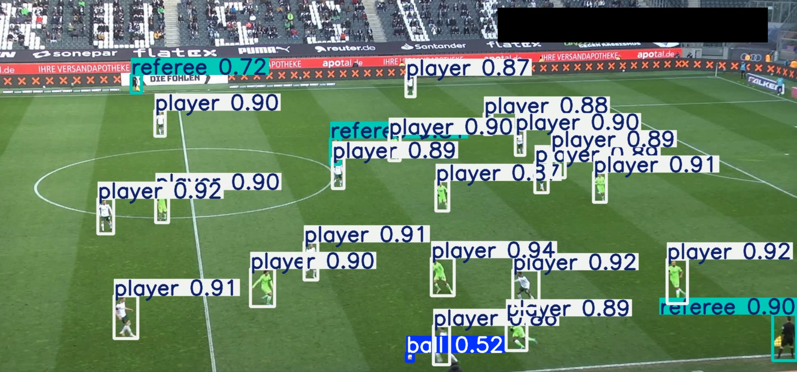

Soccer Analysis:

This application analyzes video clips from soccer matches to accurately distinguish and identify objects such as players, the ball, and referees. It utilizes the YOLOv8 object detection model, which will be enhanced by training with a dataset from Roboflow to improve its accuracy and performance.

Raw Input:

To begin the analysis, we first need to install the Ultralytics library and load the YOLOv8 model, specifically yolov8s. There are different versions of the model, such as yolov8m and yolov8x, where the letters 's', 'm', and 'x' represent the model's capabilities 's' for small, 'm' for medium, and 'x' for a more powerful model.

The choice of model depends on your PC’s specifications. Once the appropriate YOLO model is selected, we can run the object detection process. The model will detect objects in the video, drawing bounding boxes around them and assigning confidence scores.

It is important to note that all players and referees are classified as 'persons' by default. This is because the pre-trained YOLO model does not differentiate between different types of people, whether they are soccer players, basketball players, or referees—they are all identified simply as 'persons'.

Once you we run the model on the input video we will get the following output:

We can see how the model actually creates the bounding box with the following output:

''' EXAMPLE OF BINDING BOX For yolov8s model (Overall detection is not that good as the object detection is limited by the amount of registerd objects)

cls: tensor([0.]) -----  0 means person
conf: tensor([0.7660]) ---- Confidence of the object being an person
data: tensor([[5.3302e+02, 6.8714e+02, 5.7907e+02, 7.8698e+02, 7.6599e-01, 0.0000e+00]])
id: None
is_track: False
orig_shape: (1080, 1920)
shape: torch.Size([1, 6])
xywh: tensor([[556.0414, 737.0588,  46.0479,  99.8365]]) ---- cords of bounding box
xywhn: tensor([[0.2896, 0.6825, 0.0240, 0.0924]])
xyxy: tensor([[533.0175, 687.1406, 579.0654, 786.9771]])
xyxyn: tensor([[0.2776, 0.6362, 0.3016, 0.7287]])
ultralytics.engine.results.Boxes object with attributes:
'''

To improve the model and enable it to distinguish referees from players, we will use a sample dataset provided by Roboflow. The setup process is detailed in the soccer_training_yolo_v5.ipynb file.

We start by installing the necessary libraries, then downloading the dataset from Roboflow. Finally, we train the object detection model. For the most accurate results, we train the model for 100 epochs.

Before discussing the output, let's understand how the data is processed. Each frame of the video is fed into the model, and for each frame, there is a labeled identification that corresponds to every player. This approach falls under supervised learning, where the dataset consists of labeled examples that guide the model’s learning process.

Below is an example of frame and its corresponding object idetnfication labels

Frame:

Labeled Data:

Now we understand how the training works we can finally take a look at the final output once the model has undergone training

Output once the model has undergone training:

With the newly trained model, we can see that objects are identified more precisely. Players are now labeled as 'players,' and referees are correctly classified as 'referees.' This improvement is a direct result of the labeled data we provided during training.

Below is an example of how the updated model behaves. The following output represents the bounding box of a single player within a frame. Previously, all players and referees were classified as 'persons' (class 0), but now, the model differentiates between them using the following class mappings:

{0: 'ball', 1: 'goalkeeper', 2: 'player', 3: 'referee'}

- cls (class) represents the type of object detected. In this case, cls: 2 indicates that the object is a player.
- conf (confidence) represents the model’s confidence level in this prediction. Here, the confidence is 30%, meaning the model is 30% sure that this object is a player.

'''BINDING BOX For yolov5s  trained model
names: {0: 'ball', 1: 'goalkeeper', 2: 'player', 3: 'referee'}

cls: tensor([2.])
conf: tensor([0.3066])
data: tensor([[1.1243e+03, 7.0749e+02, 1.2021e+03, 7.9795e+02, 3.0660e-01, 2.0000e+00]])
id: None
is_track: False
orig_shape: (1080, 1920)
shape: torch.Size([1, 6])
xywh: tensor([[1163.1974,  752.7164,   77.7913,   90.4594]])
xywhn: tensor([[0.6058, 0.6970, 0.0405, 0.0838]])
xyxy: tensor([[1124.3018,  707.4868, 1202.0930,  797.9462]])
xyxyn: tensor([[0.5856, 0.6551, 0.6261, 0.7388]])
'''

